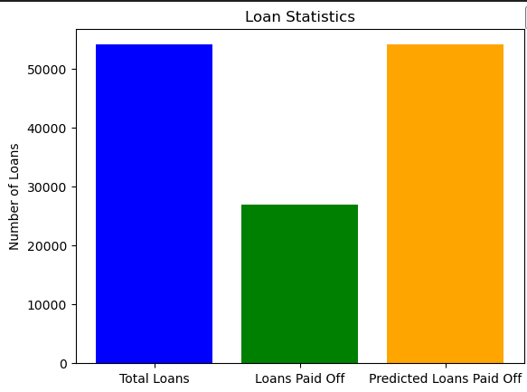
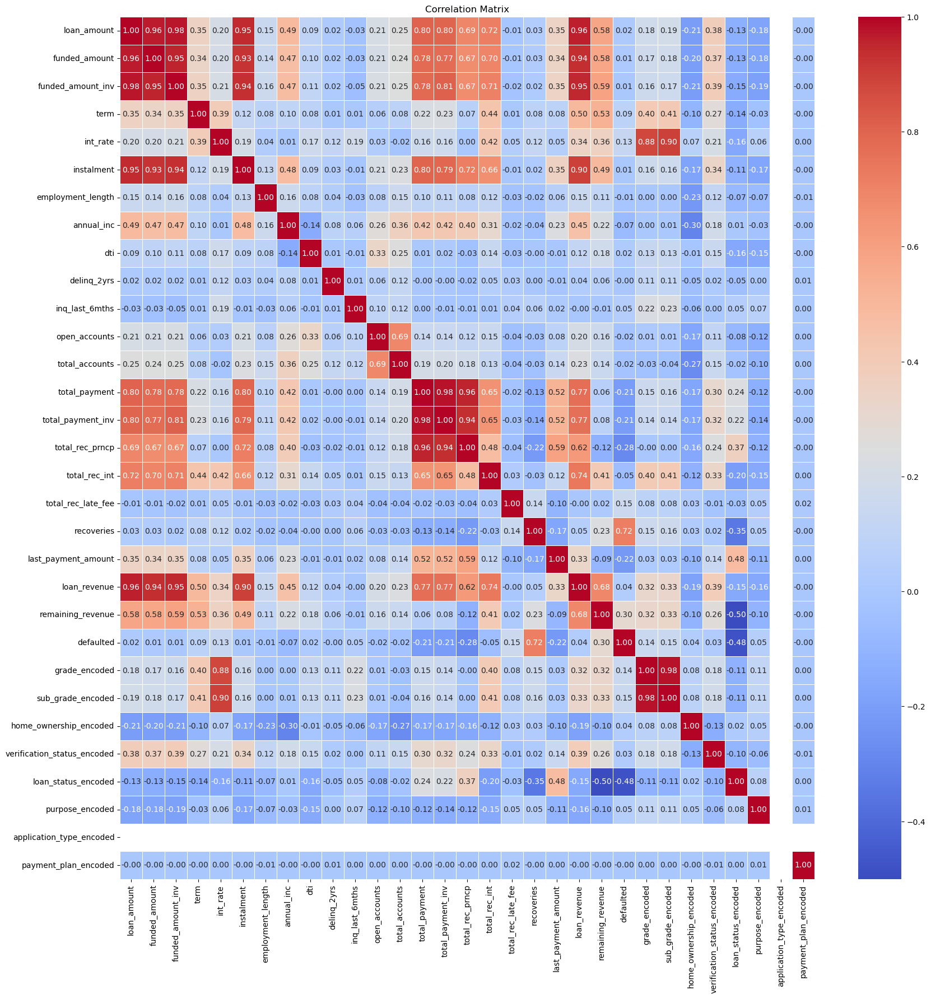

# Exploratory Data Analysis - Customer Loans in Finance

In this project, I have explored a loan payments database to generate exploratory data analysis, and pull together learning content up to this point. This was done as part of the AiCore Data Analytics pathway content. [Exploratory data analysis](https://en.wikipedia.org/wiki/Exploratory_data_analysis) is an approach commonly used in data analysis to summarise key characteristics of a dataset. 

Here, I have created a set of classes that are able to perform all of the key steps in EDA. Then, I have taken a loan payments dataset and described each step of the EDA process as I have performed them. 

Throughout this process, I have gained a better understanding of the important factors of EDA and have appreciated that there is no blueprint for the "perfect" EDA, but rather it is the reasoning behind your decisions that are the most important factor. 

## Requirements

- Fork this repo
- Clone this repo
- Python3

## Usage

To use this jupyter notebook, open it and load in your own data. 

Once you have done this, you can use the classes and methods show to work through you analysis. I have provided my own reasoning for my dataset, so feel free to use this as a guide. 

Uncomment lines as necessary when describing the dataset. 

## File Structure 

**db_utils.py**: This module connects to the database.
- __`load_creds()`__: This function loads a .yaml file and returns the credentials (creds). The.yaml file containing the credetials is not in this repo for privacy reasons. In order to connect your own credentials, either name the yaml file `credentials.yaml` or alterhe code accordingly. 
- __`RDSDatabaseConnector()`__: This class connects to the database using the credentials loaded in from __`load_creds()`__.
    - __`__init__()`__: This intialises the main variables of the class. It one parameter along with self:
        - `db_creds` (dict): A dictionary containing the credentials required to access the appropriate database.

**loan_data_dict.md**: This file contains the definitions of all the columns in the dataset. 

**load.py**: This module contains the function for loading the csv file. 

**dataframeinfo.py**: This module contains the class defining methods to describe the dataframe:
- stats_overview - gives a statistical overview of the data.
- datatypes - returns the datatypes. 
- category_count - returns a count for each categorical column.
- null_count_percent - returns the null percentage for each column. 

**data_transform.py**: This module contains the class defining methods to transform the data after loading:
- extract_int - extracts numerical values from string columns. 
- to_date_column - converts date columsn to the correct date type. 
- to_cat_column - converts a column to categorical datatype.

**plotter.py**: This module contains the class defining methods to plot the data:
- histogram - creates a histogram.
- q_q_plot - creates a qq plot.
- box_plot -creates a box plot. 
- bar_plot - creates a bar plot. 

**transform.py**: This module contains the class defining methods to apply more complex transformations to the dataframe:
- impute_with_mean - imputes null values with the mean.
- impute_with_median - imputes null values with the median.
- drop_null_rows - drops null values.
- replace_nulls - replaces null values with a given value.
- identify_skewed_columns - rturns the skew values for all columns.
- transform_log - applies a log transformation to skewed columns. 
- identify_outliers_IQR - identifies outliers using the IQR method. 
- identify_outliers_IQR_all_columns - identifies outliers in all columns. 
- outlier_count_per_column - gives the outlier count per column.
- remove_outliers - removes outliers from columns in a given list. 
- identify_correlated_columns - applies the perason correlation method to all   
    columns in the dataframe. Generates a heatmap to show the correlation.
- encode_categorical_columns - encodes categorical data to be 
    used in a correlation matrix. 

**loans.ipynb**: This file is where the analysis will be run. All of the modules are imported, along with any key packages. 

For more information on each of these, please see the docstrings in the module files. 

## Example Plots

Bar plot showing the number of loans predicted to be paid off in the next 6 months:

Correlation matrix:

## Installation

    $ git clone https://github.com/jvrolfe/exploratory-data-analysis---customer-loans-in-finance.git

## Licence

Licence: `None`